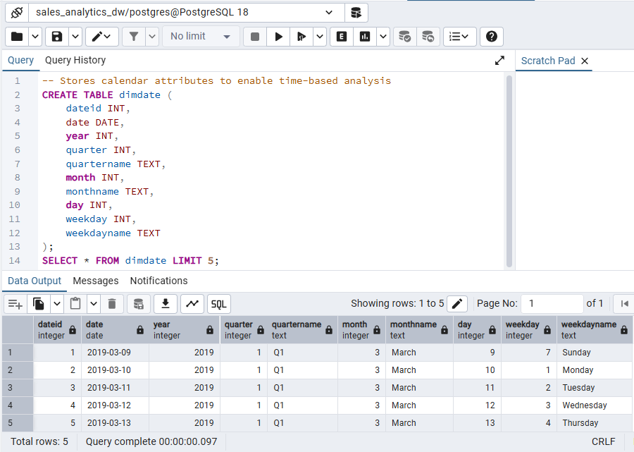
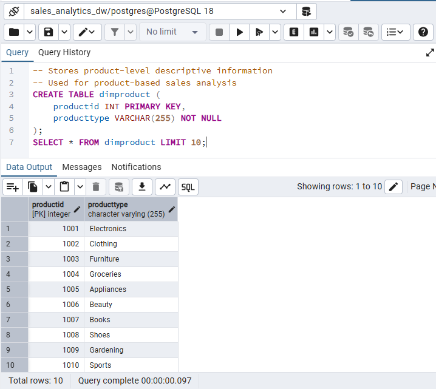
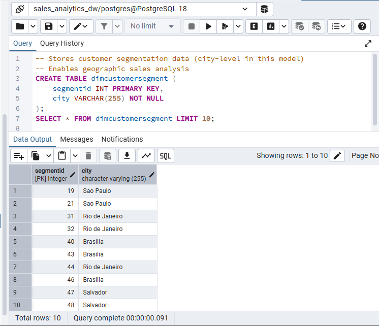
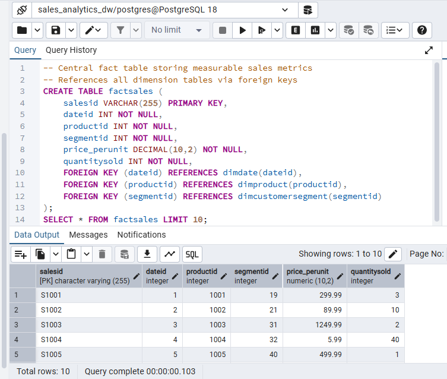
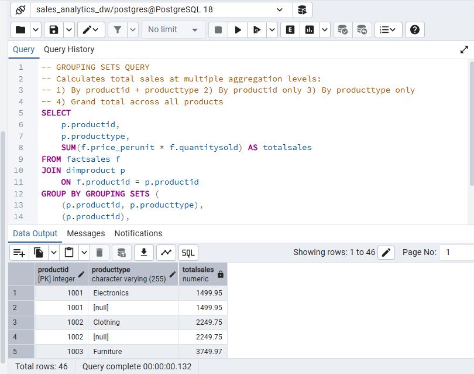
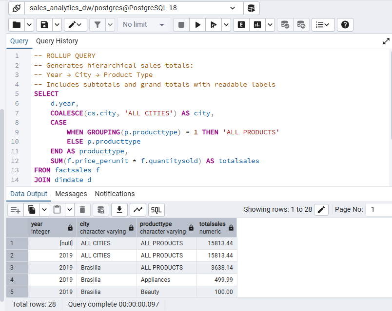
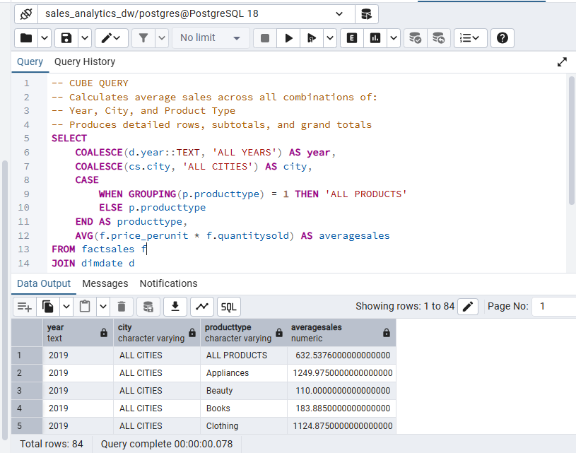

# 🏬 Retail Sales Data Warehouse
### 🎓 IBM Data Engineering Specialization – Portfolio Project

---

## 📑 Table of Contents
1. [Overview](#-overview)
2. [Business Task](#-business-task)
3. [Dataset Detail](#-dataset-detail)
4. [Tools & Technologies Used](#-tools--technologies-used)
5. [Skills Demonstrated](#-skills-demonstrated)
6. [Project Workflow](#-project-workflow)
7. [Results](#-results)
8. [Key Findings](#-key-findings)
9. [About this Project](#-about-this-project)

---

## 🔍 Overview
This project focuses on designing and implementing a **retail sales data warehouse** using PostgreSQL.  
The warehouse is structured using **dimensional modeling (star schema)** to support structured reporting and analytical queries for sales performance analysis across time, products, and locations.

---

## 🎯 Business Task
The objective of this project is to:
- Organize retail sales data into a structured data warehouse
- Enable efficient analysis of sales performance
- Support reporting across multiple dimensions such as time, product, and city
- Demonstrate analytical SQL capabilities used in business intelligence scenarios

---

## 🗂️ Dataset Detail
- The dataset is **synthetically generated** for learning and portfolio purposes
- Data is provided in **CSV format**
- Includes:
  - Date-related attributes
  - Product information
  - City-level customer segmentation
  - Sales transactions (price and quantity)

---

## 🛠️ Tools & Technologies Used
- **SQL**
- **PostgreSQL**

---

## 🧠 Skills Demonstrated
- Dimensional modeling (Star Schema)
- Fact and dimension table design
- Data loading from CSV files
- Advanced SQL aggregations
  - GROUPING SETS
  - ROLLUP
  - CUBE
  - Materialized views
  
---

## 🔄 Project Workflow
1. **Schema Design**
   - Designed a star schema with fact and dimension tables
   - Identified appropriate granularity for sales analysis

2. **Database Setup**
   - Created a PostgreSQL database
   - Defined dimension and fact tables using SQL DDL

3. **Data Loading**
   - Imported CSV datasets into PostgreSQL tables
   - Validated data integrity and structure

4. **Analytical Querying**
   - Wrote aggregation queries using GROUPING SETS, ROLLUP, and CUBE
   - Generated multi-level sales summaries

5. **Performance Optimization**
   - Created a materialized view to store precomputed maximum sales metrics

6. **Result Documentation**
   - Captured query outputs as images
   - Organized results for clear presentation

---

## 📊 Results

| 1. DimDate Preview |
|-------------------|
|  |
| Sample records from the date dimension table. |

---

| 2. DimProduct Preview |
|-----------------------|
|  |
| Product types used for sales analysis. |

---

| 3. DimCustomerSegment Preview |
|-------------------------------|
|  |
| City-level customer segmentation data. |

---

| 4. FactSales Preview |
|----------------------|
|  |
| Sales transaction records with price and quantity. |

---

| 5. GROUPING SETS – Product Sales |
|--------------------------------|
|  |
| Multi-level product sales aggregation. |

---

| 6. ROLLUP – Year, City, Product Type |
|-------------------------------------|
|  |
| Hierarchical sales totals across time and location. |

---

| 7. CUBE – Average Sales |
|------------------------|
|  |
| Average sales across all dimension combinations. |

---

| 8. Materialized View – Max Sales |
|--------------------------------|
|  |
| Precomputed maximum sales by city and product. |

---

## 📌 Key Findings
- Sales performance varies significantly by city and product type.
- Aggregation techniques enable flexible, multi-dimensional reporting.
- Materialized views improve performance for repeated analytical queries.
- Dimensional modeling simplifies complex analytical requirements. 

---

## ℹ️ About this Project
- This project was completed as part of the **IBM Data Engineering learning path** and developed as a **portfolio project** to demonstrate practical data warehousing and analytical SQL skills using PostgreSQL.

---
